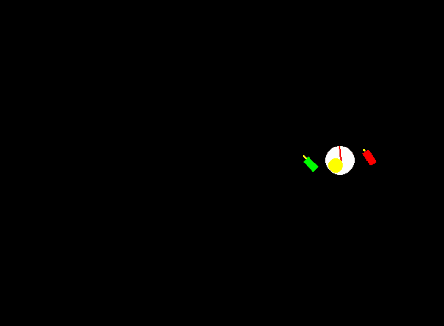

# Senza

> An 2D environment for training control policies for a quadrotor drone (technically a planar birotor). Rigth now, only Soft-Actor-Critic is implemented but I may revisit later (there are some failed PID and TD3 attempts :)).

 

  
 

## Development

1. Create a virtual environment (I recommend `venv`).
2. Run `.\venv\Scripts\activate` to enter the virtual environment
3. Install the dependencies with `pip install -r requirements.txt`
4. To train a new SAC policy from scratch, edit `src/run.py` so that `eval=False, load=False, render=False`. Training rewards will be logged and checkpoints will be saved periodically. Training can be further configured in `Agents/sac/run.py`.
5. To load a model, place the 3 checkpoints in the `Agents/sac/load` directory and specify `load=True` in `run.py`.
6. I've supplied my best weights (trained on cpu...) in releases.

The drone environment runs on Pygame and can be found in `drone/DroneEnv.py`. I tried my best to make it Gym compliant, but there are likely things I've missed.

## TODO
- [ ] PID
- [ ] LQR
- [ ] MPC
- [ ] TD3
- [ ] Prioritized Replay
- [ ] LA3P

## References
- Inspiration for the environment came from John Buffer's [AutoDrone](https://github.com/johnBuffer/AutoDrone) which uses a genetic algorithm to train the policy.
- The SAC implementation was primarily referenced from [toshkiwa](https://github.com/toshikwa) 
